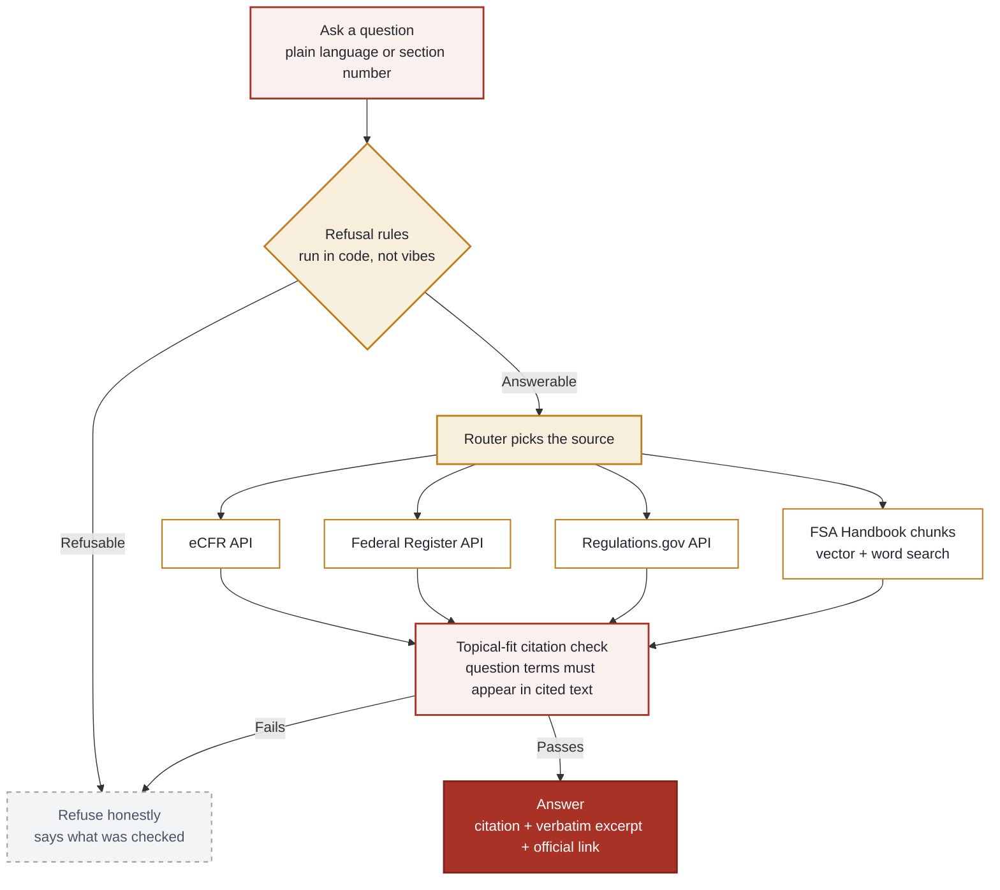

# myproject-hub: Ask Regs (ED Source Desk) + PM portfolio

A grounded regulation lookup for U.S. federal student aid, built and governed like a real AI product: retrieval over generation, verified citations, rule-based refusals, and an eval suite with human review. This repo is also my product portfolio homepage. Live: [myproduct.life/ask-regs](https://myproduct.life/ask-regs)

> The repo name is historical. Think of this as two things in one codebase: **Ask Regs**, the product, and **myproduct.life**, the portfolio site it ships on.

## The problem

Financial aid administrators and students make high-stakes decisions from federal regulation: Pell eligibility, loan limits, satisfactory academic progress. General-purpose AI chatbots answer these questions fluently and unreliably, inventing citations or blending award years. In a compliance domain, a confident wrong answer is worse than no answer.

Ask Regs ("ED Source Desk") takes the opposite position: **cite the official text, or refuse.** It answers from eCFR, the Federal Register, Regulations.gov, and the current FSA Handbook, quoting passages verbatim with a link to the exact passage on the official page. When it cannot support an answer, it says so and explains what it checked.

## The product

- **Public lookup** (`/ask-regs`): no login, no tracking of who you are. Type a plain-language question, get the official citation, the verbatim excerpt, and the official link. Every result is labeled honestly: answer, partial answer, or related reading.
- **Refusals as a feature**: student-specific eligibility questions, individual tax advice, private membership content, and vendor-internal setup are refused by rules in code, not by vibes. Personal identifiers (SSN-shaped numbers, pasted ISIR data) are refused and never stored.
- **Award-year discipline**: the tool answers for the current award year (2026-27). Prior-year material is stored but excluded, so answers never mix award years.
- **Owner-only AI explanation**: a plain-English explanation layer exists but is deliberately not public. It is token-gated, runs server-side, and every bullet must cite a source ID; a draft that cites an unknown source, leaves a claim uncited, or states a dollar amount found only in fictional handbook examples is discarded.
- **Portfolio homepage** (`/`): case studies (Project SOR, COD annual update, the agent-callable policy engine) and working principles. The throughline: regulation in, tested software out.

## Key product decisions

1. **Retrieval, not generation.** Nothing is ever generated as an answer. The system retrieves official text and displays it; the model's only job is the gated, owner-only explanation, which is itself source-checked.
2. **Refuse rather than guess.** In the first pilot results, the misses were answerable questions left without a confident citation (testers called it too cautious), not fabricated answers. That is the failure mode I chose: a missing answer is visible and fixable, a fabricated citation is not.
3. **Citations must earn trust.** Every free-text citation passes a topical-fit check (the question's distinctive terms must appear in the cited text). A section number alone cannot validate an unrelated answer. Handbook example amounts (the FSA Handbook uses fictional Pell figures in examples) are flagged and can never be the answer to an amount question.
4. **Staged releases for content.** New handbook chapters import as `staged`, visible only on preview builds, and go live only after a named `promote` following human review. The live site kept working unchanged while unreviewed content sat in the shared database.
5. **Evals gate releases.** A written release gate blocks any release on: a missed refusal, an unexplained citation regression, a fictional amount shown as an answer, a failing test, stored refusable text, or unreviewed new content. Failures are findings, not tests to loosen.

## Architecture

### How a question flows



- **Server-side lookups** (`src/lib/ed-source-desk.server.ts`): all regulation calls run server-side. API keys never reach the client, and refusal rules cannot be bypassed from the browser.
- **Hybrid retrieval**: handbook passages are embedded with `google/gemini-embedding-2` (3,072 dims) and searched by exact vector search, paired with plain word search. Word-search matches alone can never promote a result to an answer. Heading-aware ranking; a chapter's topic words are ignored so sections do not tie on them.
- **Traceable citations**: each chunk carries a human label plus an official-URL text-fragment locator, so every citation resolves to the exact spot on the source page.
- **Usage and cost monitoring**: every lookup, explanation, and comparison is logged; daily caps (1,000 lookups, 300k AI tokens, 200 feedback) fail open so monitoring never blocks a lookup. Feedback comments pass the same refusal screening as questions.
- **AI gateway**: embeddings and the owner-only explanation run through a managed AI gateway; the explanation model was chosen by measured comparison (see Evaluation).

## Evaluation

Methodology, not just scores. The eval runner (`tests/evals/run-live-evals.mjs`) posts questions to the live lookup endpoint and checks each response against a reviewed routing or refusal expectation: routing, citations, labels, refusals. It does **not** grade answer correctness, and HTTP 200 never counts as correctness. New cases start `candidate-unreviewed` and become `reviewed` only after I check them on screen. Held-out questions are never used to tune retrieval.

| Suite | Cases | Result | Date |
|---|---|---|---|
| Stage 1: routing + refusals | 18 cases, 122 checks | 18/18 on first independent live run | 2026-09-30 |
| Stage 2A: Pell passages (Vol 7 Ch 2) | 6 cases, 61 checks | 6/6 live after promote | 2026-09-30 |
| Stage 2B: Pell Ch 3 | 2 cases, 18 checks | 2/2 live after promote | 2026-09-30 |
| Adversarial refusals | 15 probes | 15/15 on live after Phase 0 fixes | 2026-10-04 |
| Unit tests (CI, offline) | 77 | 77/77 | 2026-10-04 |

Total across suites: 26 cases, 201 automated checks. Preview evals caught 5 regressions before release; the batch was held on preview through four fix rounds until every suite was clean.

**Model comparison** (owner-only harness, rubric grading by a separate judge model on faithfulness, completeness, clarity, 1-5): Gemini 2.5 Flash passed 14/14 source checks; the Gemini judge scored it faithfulness 5.0, completeness 3.71, clarity 5.0. I graded 25 of 28 explanations myself and favored GPT-5 mini on all three measures, agreeing with the judge exactly on faithfulness 13 of 25 times. A chance-adjusted check (weighted Cohen's kappa) put our agreement no better than chance on all three measures ([`JUDGE-CALIBRATION.md`](docs/ed-source-desk/JUDGE-CALIBRATION.md)), so judge scores never decide a release on their own. I kept Flash and tightened its instructions, recording the cost-versus-quality trade explicitly.

**Real-user pilot**: live pilot with financial aid colleagues began 2026-10-02. Day 1: 24+ lookups, all under about 1.2 seconds (server time, lookup path only), and 15+ Yes/No votes with comments. Each day-1 miss was assigned a root-cause code (a display cutoff on long sections, routing, the citation-fit threshold). Fixes follow the week-1 review as general rules, measured before and after on held-out questions. A privacy review on 2026-10-04 found 2 stored questions that should have been refused; both rows were purged and the refusal rules were closed with general fixes, not per-question patches.

Full evidence trail: [`docs/ed-source-desk/AI-EVIDENCE-LOG.md`](docs/ed-source-desk/AI-EVIDENCE-LOG.md) (every number traces to a run or commit), [`tests/evals/README.md`](tests/evals/README.md), [`docs/ed-source-desk/RELEASE-GATE.md`](docs/ed-source-desk/RELEASE-GATE.md).

## Repo map

```
src/routes/ask-regs.tsx          Public Ask Regs page
src/routes/index.tsx             Portfolio homepage
src/routes/api/ed-source-desk/
  lookup.ts                      Public lookup endpoint (Zod-validated)
  explain.ts                     Owner-only AI explanation (token-gated)
  feedback.ts                    Public Yes/No + comment feedback
  goldens.ts                     Golden-case endpoint
  admin/import.ts                 Handbook import: dry-run → import → promote
  admin/compare.ts                Owner-only model comparison
  admin/stats.ts                  Owner-only usage summary
src/lib/ed-source-desk.server.ts Lookup engine: routing, retrieval, fit checks, refusals
src/lib/explain.server.ts        Explanation pipeline + source-check enforcement
src/lib/handbook-import.server.ts Staged handbook import pipeline
src/lib/usage.ts                 Caps, logging shapes, weekly summaries (unit-tested)
src/data/ed-source-desk/         Golden cases, handbook source registry
tests/evals/                     Eval suites, live runner, model-compare harness
tests/unit/                      Refusal rules, usage logic (offline, runs in CI)
docs/ed-source-desk/             Evidence log, pilot handoff, release gate, portfolio plan
supabase/migrations/             documents/chunks (service_role only), usage + feedback tables
```

## Tech stack

TanStack Start (React 19) on Cloudflare, Supabase (Postgres + pgvector, RLS, service_role-only tables), Tailwind CSS 4, TypeScript, Zod. Embeddings via `google/gemini-embedding-2`. Built with AI coding agents (Claude Code, Codex, Lovable) under my direction; CI runs typecheck, unit tests, and fixture validation on every PR with no network calls.

## How this was built

Plainly: I defined the product, wrote or approved the requirements, reviewed results on screen, and made every release decision. AI coding agents wrote the code under my direction across 21 reviewed pull requests (2026-09-30 to 2026-10-02), each with a description, tests, and a verification section. I approved every merge and release, published through Lovable, and had the live checks run. The eval suites, the release gate, and the evidence log are the artifacts of that process, and they are the point: directing AI builders with a quality bar is the work this repo demonstrates.

## Status and roadmap

Live at [myproduct.life/ask-regs](https://myproduct.life/ask-regs). Current award year: 2026-27. Handbook coverage: FSA Handbook Vol 3 Ch 1 and Vol 7 Ch 1-6 (Pell Grants), expanding chapter by chapter through the staged import pipeline. A real-user pilot with financial aid colleagues is underway; the week-1 review runs on or after 2026-10-09. Planned next: one bounded, owner-only, read-only agent experiment compared against the current router on the same held-out questions.

## Related

- **Project SOR** ([tirath5u/project-sor](https://github.com/tirath5u/project-sor)): the sibling project, a deterministic OBBBA loan-limit engine exposed as a public API and MCP server. SOR is the engine-as-a-tool; Ask Regs is grounded retrieval. Same domain, complementary AI patterns.
- **Source corpus** ([tirath5u/financial-aid-documents](https://github.com/tirath5u/financial-aid-documents)): the versioned public sources (FSA Handbook, COD Technical Reference, HR1 text) that retrieval systems like this one draw from.
- **Live portfolio**: [myproduct.life](https://myproduct.life)

## About

I'm Tirath Chhatriwala, an AI product manager building trustworthy AI for regulated financial workflows. Fourteen years in ed-tech and federal student aid, Army veteran, and I built my company's first AI assistant in Copilot Studio. This repo is my portfolio and my lab: I define the product, direct AI coding agents, and hold the quality bar with evals and release gates. I'm currently looking for principal product manager roles where domain depth and AI judgment matter.

- GitHub: [tirath5u](https://github.com/tirath5u)
- LinkedIn: [Tirath Chhatriwala](https://www.linkedin.com/in/tirath-c-7228b814)
- Live work: [Ask Regs](https://myproduct.life/ask-regs) · [myproduct.life](https://myproduct.life) · [SOR engine](https://sor.myproduct.life)
